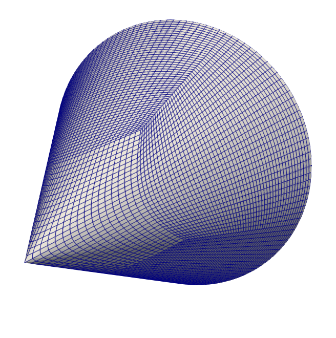
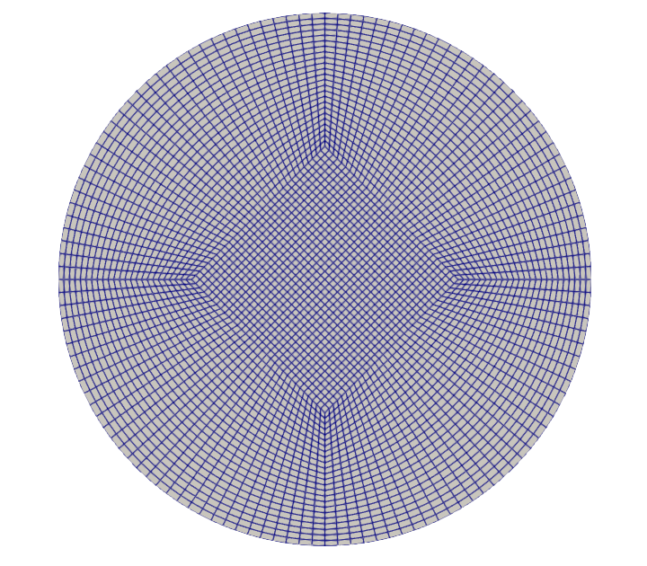

# pySurf — structured surface mesher

A user-guided **multiblock structured surface mesh generator**, built as the
Phase 0/1 prototype of [structured_surface_mesher_plan.md](doc/structured_surface_mesher_plan.md).

```text
global complex surface
→ split into simple named local surfaces
→ mesh each surface in local coordinates
→ enforce matching edges
→ assemble as multiblock structured surface mesh
```

The generated surface meshes target hyperbolic volume extrusion with
**pyHyp** (MDO Lab): Plot3D output matches pyHyp's reader exactly, all
presets produce consistent outward `i × j` normals, and shared block edges
are node-coincident so pyHyp's connectivity detection just works.

<p align="center">
  
  
</p>
<p align="center"><em>Closed cone preset (13 blocks): apex resolved as a regular vertex of 4 quads,
O-grid base cap — validated end-to-end through pyHyp extrusion and an ADflow Mach 1.2 solution.</em></p>

## Install & quickstart

```bash
pip install -e .            # needs numpy + pyyaml (pulled automatically)

pysurf presets                                 # list available preset surfaces
pysurf mesh examples/cylinder/blocking.yaml    # generate the 11-block cylinder
pysurf validate examples/sphere/blocking.yaml  # build in memory + run checks
```

`pysurf mesh` writes into `<spec dir>/output/`:

| file | purpose |
|---|---|
| `<name>.vtm` + `<name>/*.vtp` | ParaView multiblock preview (one file per named block) |
| `<name>.fmt` | Plot3D multiblock surface — pyHyp `fileType: PLOT3D` input |
| `<name>_blocks.json` | debug dump: metrics, connectivity, open edges |
| `<name>_quality.txt` | quality table + connectivity report |
| `run_pyhyp_<name>.py` | ready-to-edit pyHyp extrusion script (open edges listed for BCs) |

## Preset surfaces (Phase 0: no CAD needed)

| preset | blocks | notes |
|---|---|---|
| `cylinder_side` | 1 | periodic i with duplicated seam column; outward normals |
| `cone_side` | 1 | frustum (both radii > 0); sharp apex intentionally rejected |
| `cone_ogrid` | 8 | full cone **including apex**: top view is a disk O-grid whose center square is split into 4 quads meeting at the apex, then lifted by `z = h(1 − ρ/R)`; apex is a regular vertex of 4 cells (no polar singularity) |
| `disk_ogrid` | 5 (8 split) | circular or elliptic (`semi_axes`) cap: center diamond + 4 quadrants; `normal: "+z"/"-z"`; optional `split_center` |
| `annulus` | 1 | planar ring, seam like the cylinder |
| `plane` | 1 | parallelogram from `origin`, `u`, `v` vectors |
| `sphere_cubed` | 6 | equiangular cubed sphere, watertight, no poles |

### Orientation

Axisymmetric presets (`cylinder_side`, `cone_side`, `cone_ogrid`,
`disk_ogrid`, `annulus`) build in a local +z frame and accept
`axis: "+x"|"-x"|"+y"|"-y"|"+z"|"-z"` — the global direction of the local
+z axis, applied as a proper rotation (normals stay consistent) about
`center`. Example: a cone with its tip at the origin and tip→base along
+x uses `axis: "-x"`, `center: [height, 0, 0]`; a cap closing that body
keeps the **same** `axis`/`center` and its local `normal: "-z"`.

### Conformity rules (checked automatically)

Shared edges must have identical point counts and coincident nodes:

- cap ↔ side circle: `ni_side − 1 == 4 · (n_arc − 1)` (e.g. side `i: 129` ↔ cap `n_arc: 33`)
- `cone_ogrid` / `split_center` need **odd** `n_arc`
- caps sample arcs uniformly, so the attached side must use uniform `i` spacing

`pysurf mesh` prints the detected connectivity (including reversed-orientation
and subrange matches), reports **watertight** or the exact open edges, and
flags folded/degenerate cells with a nonzero exit code.

## Spec file anatomy

```yaml
project:
  name: cylinder

surfaces:
  cylinder_side:
    preset: cylinder_side
    radius: 1.0
    height: 5.0
    points: {i: 129, j: 65}
    spacing:                      # optional; uniform default
      j: {kind: tanh, beta: 2.0}  # uniform|cosine|sine|geometric|tanh|user

  top_cap:
    preset: disk_ogrid
    radius: 1.0
    z: 5.0
    normal: "+z"                  # bottom cap uses "-z" -> outward normals
    center_block: {ni: 33, nj: 33}
    radial_points: 25

output:
  directory: output
  vtm: true
  plot3d: true
  json: true
  quality_report: true
  pyhyp_script: true
```

## pyHyp handoff

pyHyp requirements this tool guarantees (verified against the pyHyp source):

1. ASCII Plot3D, header `nblocks`, dims `ni nj 1` (nk **must** be 1), then per
   block all X, all Y, all Z with i fastest (`readPlot3d.F90`).
2. Consistent **outward** normals on every block — pyHyp hard-stops with
   "Normal directions may be wrong" otherwise, and has no flip option.
3. Node coincidence on shared edges within `nodeTol` (default 1e-8); our
   shared edges are exact by construction.
4. O-grid caps instead of polar caps (polar singularities are fragile in
   hyperbolic extrusion).

Open edges (e.g. the base circle of an open cone) are listed in the
generated `run_pyhyp_*.py` next to the `BC` dict — assign
`iLow/iHigh/jLow/jHigh` conditions per 1-based block index there
(`pysurf` `i_min → iLow`, `j_max → jHigh`, ...).

## Layout

```text
pysurf/
├── blocks.py            StructuredBlock (ni, nj, 3) + BlockConnection
├── meshing/
│   ├── edges.py         1-D point distributions
│   ├── tfi.py           transfinite interpolation (Coons patch)
│   ├── cylinder.py      cone.py  disk_ogrid.py  annulus.py  plane.py  sphere.py
│   ├── quality.py       areas, aspect, skew, folding detection
│   └── smoothing.py     Laplacian (fixed boundaries)
├── assembly/
│   └── connectivity.py  geometric edge matching (full/subrange, reversed), open edges
├── io/
│   ├── vtk_writer.py    .vtp/.vtm (no vtk dependency)
│   ├── plot3d_writer.py pyHyp-exact ASCII Plot3D + roundtrip reader
│   ├── json_writer.py   debug dump
│   └── pyhyp_script.py  extrusion script template
├── specs/parser.py      YAML spec -> preset dispatch
└── cli.py               pysurf mesh | validate | presets
tests/                   pytest suite (run: python -m pytest)
examples/                cylinder, cone_open, cone_closed, cone_frustum,
                         disk, elliptic_disk, annulus, rectangle, sphere
```

## Roadmap (from the plan document)

- **Phase 0/1 (this)**: analytic presets + YAML specs + connectivity + writers
- **Phase 2**: STEP AP242 reader (pythonOCC via conda), named face/edge lookup
- **Phase 3/4**: CAD edge discretization, TFI on CAD faces w/ UV-space + projection
- **Phase 5/6**: CGNS output, full pyHyp/ADflow workflow (wakes, families)
